<picture>
  <source media="(prefers-color-scheme: dark)" srcset="./dark.svg">
  <source media="(prefers-color-scheme: light)" srcset="./light.svg">
  
</picture>

<code>⚪ Community: Hexlet, Metarhia</code>
<code>👷 Speciality: developer / Frontend / Backend</code> 
<code>💡 [Skills](SKILLS.md)</code>
<code>🧻 [Projects](PROJECTS.md)</code>
<code>📢 [Public talks: 0](TALKS.md)</code>
<code>👀 [Open-source contribution](CONTRIBUTION.md)</code> 
<code>🧑‍💻 Languages: HTML, CSS, JavaScript, TypeScript, Golang</code>
<code>📦 Tech stack: React, node.js</code>
<code>🪙 [Rates](RATES.md)</code> 
<code>💬 telegram: [@evsedov](https://telegram.me/evsedov)</code>
<code>📫 [i@evsedov.ru](mailto:i@evsedov.ru)</code>
